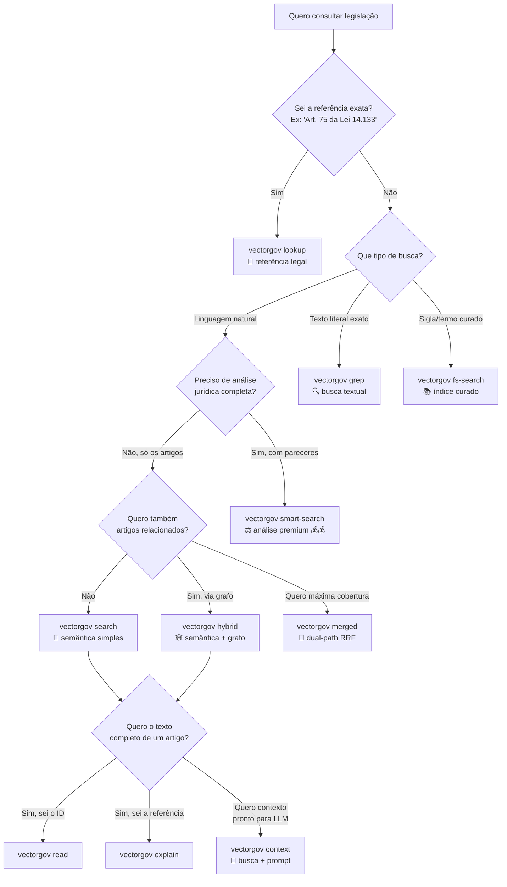

# VectorGov CLI

**CLI para busca semântica em legislação brasileira** — projetado para humanos no terminal e agentes de IA via stdin/stdout.

[](https://badge.fury.io/py/vectorgov-cli)
[](https://www.python.org/downloads/)
[](https://opensource.org/licenses/MIT)

> **Novidades**:
> - **0.3.6** — coluna "Referência" usa `hit.citation` (`Art. 75 da Lei 14.133/2021`) — formato jurídico brasileiro
> - **0.3.5** — créditos exibidos no rodapé de todos os comandos pagos
> - **0.3.2** — zero truncamento de conteúdo + TTY detection automática (pipes recebem `llm` por padrão)
> - **0.3.1** — parsing GNU-style: flags e argumentos em qualquer ordem (`search "ETP" --top-k 3` ou `search --top-k 3 "ETP"`)

---

## ⚡ Quickstart (1 minuto)

```bash
pip install vectorgov-cli
vectorgov auth login              # ou: export VECTORGOV_API_KEY=vg_...
vectorgov search "O que é ETP?"
```

```
[1/5] Art. 18 da Lei 14.133/2021 (score: 0.97)
Art. 18. A fase preparatória do processo licitatório é caracterizada pelo planejamento ...
EVIDENCE: https://vectorgov.io/api/v1/evidence/leis%3ALEI-14133-2021%23ART-018
PDF: https://vectorgov.io/api/v1/evidence/download/source/LEI-14133-2021
---
```

> 🤖 **Para LLMs e agentes**: defina `export VECTORGOV_OUTPUT=llm` e todos os comandos retornam texto puro otimizado (sem ANSI, ~40% menos tokens). Quando o stdout não é um terminal, o CLI **detecta automaticamente** e usa `llm` por padrão.

---

## 🌳 Qual comando usar?



| Comando | Latência | Custo | Pra que serve |
|---|---|---|---|
| `vectorgov search` | 2-7s | 💰 | Busca semântica simples |
| `vectorgov smart-search` | 5-18s | 💰💰 | Análise jurídica completa |
| `vectorgov hybrid` | 3-10s | 💰 | Semântica + grafo de citações |
| `vectorgov merged` | 2-5s | 💰 | Dual-path: hybrid + filesystem (RRF) |
| `vectorgov lookup` | < 1s | 💰 | Resolve "Art. X da Lei Y" |
| `vectorgov grep` | < 1s | 💰 | Busca textual literal |
| `vectorgov fs-search` | < 1s | 💰 | Índice curado |
| `vectorgov read` | < 1s | **free** | Lê texto canônico completo |

> 🧭 **Decisão por caso de uso**: veja a [Cheat Sheet](docs/cheat-sheet.md) — 1 página com comparações detalhadas, padrões idiomáticos e troubleshooting.

---

## 📋 Os 20 comandos do CLI

### 🔍 Busca (9)

| Comando | O que faz |
|---|---|
| [`search`](docs/commands.md#search) | Busca semântica simples (3 modos: fast/balanced/precise) |
| [`smart-search`](docs/commands.md#smart-search) | Análise jurídica completa com Juiz LLM (Premium 💰💰) |
| [`hybrid`](docs/commands.md#hybrid) | Semântica + expansão por grafo de citações (1-2 hops) |
| [`lookup`](docs/commands.md#lookup) | Resolve referência legal → dispositivo exato (com batch e pipe) |
| [`grep`](docs/commands.md#grep) | Busca textual literal |
| [`fs-search`](docs/commands.md#fs-search) | Índice curado determinístico |
| [`merged`](docs/commands.md#merged) | hybrid + filesystem unificados via RRF |
| [`read`](docs/commands.md#read) | Lê texto canônico completo (free) |
| [`explain`](docs/commands.md#explain) | lookup + read em uma chamada |

### 🤖 LLM helpers (3)

| Comando | O que faz |
|---|---|
| [`context`](docs/commands.md#context) | Bloco completo (busca + prompt) pronto para LLM |
| [`tokens`](docs/commands.md#tokens) | Estima tokens antes de mandar para LLM (free) |
| [`prompts`](docs/commands.md#prompts) | System prompts pré-otimizados (list/show) |

### 📊 Info & feedback (4)

| Comando | O que faz |
|---|---|
| [`docs list/info`](docs/commands.md#docs) | Lista normas indexadas e mostra metadados (free) |
| [`audit logs/stats`](docs/commands.md#audit) | Histórico e estatísticas de uso (free) |
| [`quota`](docs/commands.md#quota) | Uso do plano e créditos restantes (free) |
| [`feedback send`](docs/commands.md#feedback) | Like/dislike de resultado (free) |

### 🛠️ Setup & config (4)

| Comando | O que faz |
|---|---|
| [`auth login/status/logout`](docs/commands.md#auth) | Salva/consulta/remove API key |
| [`config list/get/set/delete`](docs/commands.md#config) | Gerencia `~/.vectorgov/config.yaml` |
| [`init`](docs/commands.md#init) | Cria arquivos AI (CLAUDE.md, .cursorrules, AGENTS.md) |
| [`version`](docs/commands.md#version) | Mostra versão (`--version` ou `-V`) |

> 📖 **Reference técnica completa**: cada comando com flags, formatos, exemplos avançados em [docs/commands.md](docs/commands.md).

---

## 🍳 Receitas comuns

### Receita 1 — Buscar e colar em ChatGPT/Claude

```bash
vectorgov context "Quando dispensar licitação?"
```

Gera bloco completo (busca + system prompt jurídico) pronto para colar em qualquer LLM.

### Receita 2 — Resolver referência legal

```bash
vectorgov lookup "Art. 75 da Lei 14.133"
```

Retorna o texto consolidado do artigo (caput + parágrafos + incisos).

### Receita 3 — Batch de referências

```bash
vectorgov lookup "Art. 75, Art. 18 e Art. 33 da Lei 14.133"
# ou
printf "Art. 75 da Lei 14.133\nArt. 33 da Lei 14.133" | vectorgov lookup --pipe
```

### Receita 4 — Filtrar por norma específica

```bash
vectorgov search "credenciamento" --doc LEI-14133-2021 --top-k 10
```

### Receita 5 — Inicializar projeto AI

```bash
vectorgov init --all
# Cria CLAUDE.md, .cursorrules, AGENTS.md
```

### Receita 6 — Estimar tokens antes do LLM

```bash
vectorgov tokens "dispensa de licitação" --top-k 10
```

### Receita 7 — Pipeline shell com jq

```bash
# Capturar query_id e mandar feedback
QUERY_ID=$(vectorgov search --raw "ETP" | jq -r '.query_id')
vectorgov feedback send $QUERY_ID --like
```

> 🍳 **Mais receitas**: [docs/recipes.md](docs/recipes.md) tem 20 fluxos completos.

---

## 📤 Formatos de saída

Todos os comandos de busca suportam: `table` (padrão), `json`, `text`, `llm` e `--raw`.

```bash
vectorgov search "ETP"                        # table (interativo)
vectorgov search "ETP" --output json          # JSON com syntax highlight
vectorgov search "ETP" --output llm           # texto puro (otimizado para LLM)
vectorgov search --raw "ETP" | jq '.hits[0]'  # JSON bruto para pipes
```

> 💡 **TTY detection**: o CLI detecta automaticamente quando o stdout não é um terminal (pipe, redirect, CI/CD) e usa `llm` por padrão. Não precisa configurar nada para integrar com agentes.

---

## 🌐 Variáveis de ambiente

| Variável | Descrição |
|---|---|
| `VECTORGOV_API_KEY` | API key (alternativa a `auth login`) |
| `VECTORGOV_OUTPUT` | Output padrão: `llm`, `table`, `json`, `text` |
| `VECTORGOV_DEFAULT_MODE` | Modo padrão: `fast`, `balanced`, `precise` |
| `VECTORGOV_DEFAULT_TOP_K` | Número padrão de resultados |

## 📁 Arquivo de configuração

`~/.vectorgov/config.yaml`:

```yaml
api_key: vg_sua_chave
default_mode: balanced
default_top_k: 5
default_output: table       # ou llm, json, text
```

---

## 🤖 Para LLMs e agentes

Esta seção é específica para agentes de IA e LLMs que vão consumir o CLI via stdin/stdout.

### Setup recomendado

```bash
# Defina o formato padrão como 'llm' para a sessão
export VECTORGOV_OUTPUT=llm

# Ou inicialize um projeto AI completo
vectorgov init --all
```

### Características projetadas para agentes

- **TTY detection**: `vectorgov search "ETP" | tee out.txt` automaticamente usa formato `llm`
- **Texto puro**: sem ANSI, sem JSON, separadores `---` entre hits, links `EVIDENCE:` e `PDF:` explícitos
- **Eficiência de tokens**: ~40% menos que JSON, ~60% menos que tabela Rich
- **Citation pronta**: cada hit traz `Art. 75 da Lei 14.133/2021` no formato jurídico brasileiro
- **GNU-style parsing**: flags e argumentos em qualquer ordem (igual a `git`, `curl`, `kubectl`)
- **Sub-segundo** para `lookup`, `read`, `grep`, `fs-search`, `quota`, `auth`, `config`

### Para integração programática (Python)

Quando for consumir programaticamente, prefira o **SDK Python** ao invés de fazer parse do output:

```bash
pip install vectorgov
```

```python
from vectorgov import VectorGov

vg = VectorGov()  # lê VECTORGOV_API_KEY
result = vg.search("ETP")

for hit in result:
    label = hit.citation or hit.source
    print(f"[{hit.score:.0%}] {label}")
    print(hit.text[:200])
```

Veja [vectorgov-sdk-docs](https://github.com/euteajudo/vectorgov-sdk-docs) para a documentação completa do SDK.

---

## ✅ Provando a veracidade

Toda resposta do CLI inclui links de evidência verificável:

- **`EVIDENCE:`** — link para o trecho destacado na norma original
- **`PDF:`** — link para download do PDF oficial

Exemplo:

```bash
$ vectorgov search "ETP" --output llm

[1/3] Art. 18 da Lei 14.133/2021 (score: 0.97)
Art. 18. A fase preparatória do processo licitatório é caracterizada pelo planejamento ...
EVIDENCE: https://vectorgov.io/api/v1/evidence/leis%3ALEI-14133-2021%23ART-018
PDF: https://vectorgov.io/api/v1/evidence/download/source/LEI-14133-2021
---
```

Os links têm validade de **30 minutos** após a busca. Use-os para auditoria, citação em respostas de LLM, ou redirecionar usuários humanos para a fonte oficial.

---

## 📖 Documentação completa

| Recurso | Quando usar |
|---|---|
| 🧭 [Cheat Sheet](docs/cheat-sheet.md) | Lookup rápido — todos os 20 comandos em 1 página |
| 📖 [Reference de comandos](docs/commands.md) | Detalhe técnico de cada comando |
| 🍳 [Receitas](docs/recipes.md) | 20 fluxos completos por caso de uso |
| 📜 [CHANGELOG](CHANGELOG.md) | Histórico de versões |

---

## 🆘 Ajuda

```bash
# Ajuda geral
vectorgov --help

# Ajuda de comando específico
vectorgov search --help
vectorgov lookup --help

# Versão
vectorgov --version    # ou -V
```

---

## 🤝 Suporte

- 🐛 [GitHub Issues](https://github.com/euteajudo/vectorgov-cli-docs/issues)
- 📧 contato@vectorgov.io
- 🌐 [Playground online](https://vectorgov.io/playground)
- 📦 [SDK Python](https://pypi.org/project/vectorgov/)

---

## 📜 Licença

MIT. Veja [LICENSE](LICENSE).
