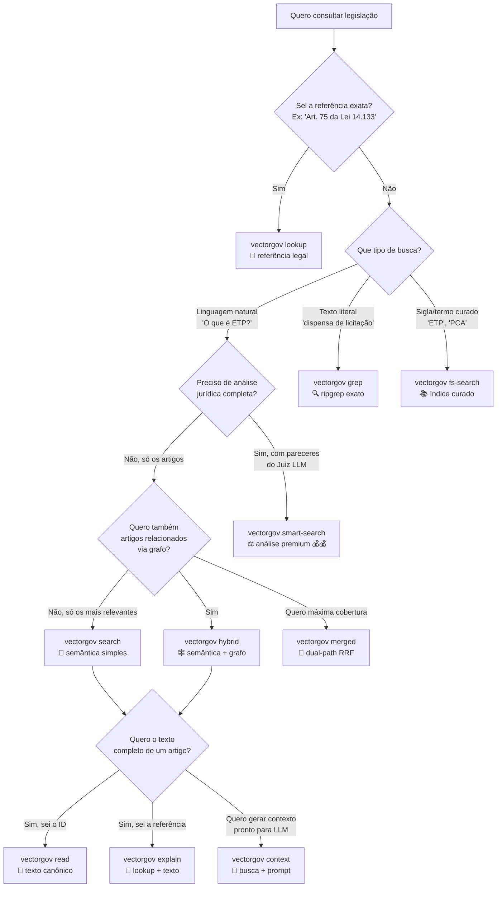

# Cheat Sheet — VectorGov CLI

> **TL;DR**: 20 comandos, 9 são de busca, o resto é apoio (auth, config, audit, feedback, init). Esta página cabe em uma tela e responde **"qual comando uso para X?"** sem você precisar abrir mais nada.

---

## ⚡ Setup em 30 segundos

```bash
pip install vectorgov-cli
vectorgov auth login              # ou: export VECTORGOV_API_KEY=vg_...
vectorgov search "O que é ETP?"
```

Output:

```
[1/5] Art. 18 da Lei 14.133/2021 (score: 0.97)
Art. 18. A fase preparatória do processo licitatório é caracterizada pelo planejamento ...
EVIDENCE: https://vectorgov.io/api/v1/evidence/leis%3ALEI-14133-2021%23ART-018
PDF: https://vectorgov.io/api/v1/evidence/download/source/LEI-14133-2021
---
```

> 💡 **Dica para LLMs/agentes**: defina `export VECTORGOV_OUTPUT=llm` na sua sessão para que todos os comandos retornem texto puro otimizado (sem ANSI, ~40% menos tokens que JSON).

---

## 🌳 Qual comando usar?



### Comparação rápida

| Comando | Latência | Custo | Pra que serve |
|---|---|---|---|
| `vectorgov search` | 2-7s | 💰 | Busca semântica simples — chat, RAG, autocomplete |
| `vectorgov smart-search` | 5-18s | 💰💰 | Análise jurídica completa com Juiz LLM |
| `vectorgov hybrid` | 3-10s | 💰 | Semântica + expansão por grafo de citações |
| `vectorgov merged` | 2-5s | 💰 | Dual-path: hybrid + filesystem com RRF |
| `vectorgov lookup` | < 1s | 💰 | Resolve "Art. 75 da Lei 14.133" para o dispositivo |
| `vectorgov grep` | < 1s | 💰 | Busca textual literal |
| `vectorgov fs-search` | < 1s | 💰 | Índice curado (siglas, termos técnicos) |
| `vectorgov read` | < 1s | **free** | Lê texto canônico completo |
| `vectorgov explain` | ~1s | 💰 | lookup + read em uma chamada |
| `vectorgov context` | ~3s | 💰 | Bloco completo (busca + prompt) pronto para LLM |

---

## 📋 Todos os 20 comandos em uma tela

### 🔍 Busca (9 comandos) — o coração do CLI

| Comando | Custo | Caso de uso |
|---|---|---|
| `vectorgov search "query"` | 💰 | Busca semântica padrão (3 modos: fast/balanced/precise) |
| `vectorgov smart-search "query"` | 💰💰 | Pipeline com Juiz LLM, dispositivos relacionados |
| `vectorgov hybrid "query"` | 💰 | Semântica + expansão por grafo (1-2 hops) |
| `vectorgov lookup "Art. X da Lei Y"` | 💰 | Resolve referência → dispositivo exato (com batch e pipe) |
| `vectorgov grep "termo exato"` | 💰 | Busca textual exata |
| `vectorgov fs-search "termo"` | 💰 | Índice curado determinístico |
| `vectorgov merged "query"` | 💰 | hybrid + filesystem unificados via RRF |
| `vectorgov read DOC-ID --span ART-NNN` | **free** | Lê texto canônico completo |
| `vectorgov explain "Art. X da Lei Y"` | 💰 | lookup + texto em uma chamada |

### 🎛️ Flags de payload (default tudo ON — desligue o que não quiser no LLM)

Valem em `search`/`hybrid`/`smart-search`/`merged`/`grep`/`fs-search`/`lookup`/`explain`/`context`/`ask`.
O **texto do dispositivo nunca é removido**. (Requer SDK `vectorgov >= 0.21.0`.)

| Flag | Desliga |
|---|---|
| `--no-nota-espec` | Nota do especialista |
| `--no-jurisprudencia` | Jurisprudência relacionada (TCU) |
| `--no-proveniencia` | Proveniência (origem) |
| `--no-links` | Links de evidência (PDF / trecho) |

```bash
# só o texto da lei
vectorgov lookup "Art. 75 da Lei 14.133" --no-nota-espec --no-jurisprudencia --no-proveniencia --no-links
```

### 🎯 Cobertura do payload (`--payload-coverage`, só no `hybrid`)

| Valor | Quando usar |
|---|---|
| `strict@10` | **Default (lean)** — resposta direta de LLM; janela menor evita *lost-in-middle* |
| `strict@20` | **Opt-in (wide)** — perguntas **multi-dispositivo**; +cobertura ao custo de **~1,7× tokens** (a resposta final de LLM não melhora) |

```bash
vectorgov hybrid "Quais os critérios de julgamento?" --payload-coverage strict@20 --show-stats
```

Toda resposta de busca traz **telemetria de tokens** (quando disponível):
`token_count_estimate` (total), `token_count_method` (método de contagem),
`token_count_breakdown` (`lei` + `curadoria` + `estrutura`) e `payload_coverage`.

### 🤖 LLM helpers (3 comandos)

| Comando | Custo | Caso de uso |
|---|---|---|
| `vectorgov context "query"` | 💰 | Bloco completo (busca + system prompt) pronto para LLM |
| `vectorgov tokens "query"` | **free** | Estima tokens antes de mandar para LLM |
| `vectorgov prompts list/show` | **free** | System prompts pré-otimizados |

### 📊 Info & feedback (4 comandos)

| Comando | Custo | Caso de uso |
|---|---|---|
| `vectorgov docs list` | **free** | Lista normas indexadas (paginado) |
| `vectorgov docs info DOC-ID` | **free** | Metadados de uma norma específica |
| `vectorgov audit logs/stats` | **free** | Histórico e estatísticas de uso |
| `vectorgov feedback send <id> --like/--dislike` | **free** | Like/dislike para melhoria contínua |
| `vectorgov quota` | **free** | Uso do plano (créditos restantes) |

### 🛠️ Setup & config (4 comandos)

| Comando | Caso de uso |
|---|---|
| `vectorgov auth login/status/logout` | Salva/consulta/remove API key |
| `vectorgov config list/get/set/delete` | Gerencia `~/.vectorgov/config.yaml` |
| `vectorgov init --all` | Cria arquivos AI (CLAUDE.md, .cursorrules, AGENTS.md) |
| `vectorgov version` (ou `--version`) | Mostra versão do CLI |

---

## 🍳 10 padrões idiomáticos

### 1. Ver resultados no terminal (modo interativo)
```bash
vectorgov search "O que é ETP?"
```

### 2. Texto puro otimizado para LLMs (sem ANSI)
```bash
vectorgov search --output llm "ETP"
# ou: export VECTORGOV_OUTPUT=llm
```

### 3. JSON estruturado com syntax highlight
```bash
vectorgov search --output json "ETP"
```

### 4. JSON bruto para pipes shell (jq)
```bash
vectorgov search --raw "ETP" | jq '.hits[0].text'
```

### 5. Filtrar por norma específica
```bash
vectorgov search "credenciamento" --doc LEI-14133-2021 --top-k 10
```

### 6. Resolver referência exata (com batch)
```bash
# Single
vectorgov lookup "Art. 75 da Lei 14.133"

# Batch via separadores
vectorgov lookup "Art. 75, Art. 18 e Art. 33 da Lei 14.133"

# Batch via stdin (uma por linha)
printf "Art. 75 da Lei 14.133\nArt. 33 da Lei 14.133" | vectorgov lookup --pipe
```

### 7. Bloco pronto para colar em ChatGPT/Claude
```bash
vectorgov context "dispensa de licitação" --output llm
```

### 8. Estimar tokens antes de mandar para LLM
```bash
vectorgov tokens "Quando dispensar licitação?" --top-k 10
```

### 9. Inicializar projeto AI (Claude Code, Cursor, Codex)
```bash
vectorgov init --all
```

### 10. Auditoria de uso
```bash
vectorgov audit stats --days 7
vectorgov quota
```

---

## 🐛 Erros comuns e fixes

| Erro | Causa | Fix |
|---|---|---|
| `AuthError: API key inválida` | Key não começa com `vg_` ou expirada | `vectorgov auth login` |
| `Cota excedida` | Plano free atingiu o limite diário | Aguarde 24h ou faça upgrade. `vectorgov quota` mostra uso |
| Output cortado/truncado | Terminal pequeno ou formato `table` | Use `--output llm` ou `--raw` para output integral |
| `m.span_id` vazio em `grep --raw` | IDs internos não expostos no response público | Use `m.citation` ou `m.document_id` (v0.3.6+) |
| `jq: command not found` | `jq` não instalado | `choco install jq` (Win) / `brew install jq` (mac) / `apt install jq` (linux) — ou prefira `--output json` direto |
| `vectorgov: command not found` | PATH não inclui pip user dir | `python -m vectorgov.cli` ou ajuste PATH |
| `--doc` não funciona em `lookup` | Foi removido na v0.2.1 | Inclua o nome da lei na referência: `"Art. 75 da Lei 14.133"` |

---

## 🌐 Variáveis de ambiente

| Variável | Descrição |
|---|---|
| `VECTORGOV_API_KEY` | API key (alternativa a `auth login`) |
| `VECTORGOV_OUTPUT` | Output padrão: `llm`, `table`, `json`, `text` |
| `VECTORGOV_DEFAULT_MODE` | Modo padrão: `fast`, `balanced`, `precise` |
| `VECTORGOV_DEFAULT_TOP_K` | Número padrão de resultados |

---

## 🧭 Próximos passos

- 📖 [Reference completa de comandos](commands.md) — assinatura, flags, formatos, exemplos avançados
- 🍳 [Receitas comuns](recipes.md) — fluxos completos por caso de uso
- 🤖 [Para LLMs e agentes](https://github.com/euteajudo/vectorgov-cli-docs#-para-llms-e-agentes) — guia específico para automação
- 🐍 [Quando usar SDK Python em vez do CLI](recipes.md#receita-14-cli-vs-sdk-quando-usar-cada-um)
